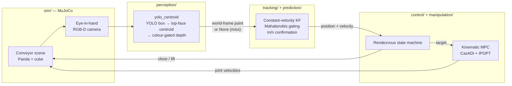
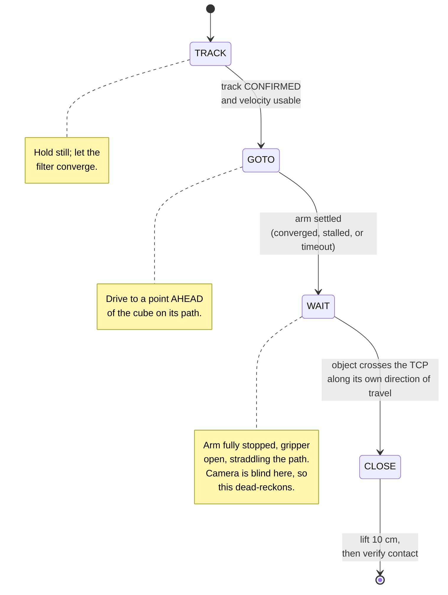

# GAUGE — Gated Uncertainty-Aware Grasping Engine

[](https://github.com/VivekSai07/GAUGE/actions/workflows/ci.yml)
[](https://github.com/VivekSai07/GAUGE/actions/workflows/codeql.yml)
[](https://github.com/VivekSai07/GAUGE/commits/main)
[](https://github.com/VivekSai07/GAUGE/pulse)
[](https://github.com/VivekSai07/GAUGE/issues?q=is%3Aissue+is%3Aclosed)
[](https://github.com/VivekSai07/GAUGE/issues)
[](https://github.com/VivekSai07/GAUGE)

A MuJoCo-simulated Franka Panda arm with an eye-in-hand RGB-D camera that
detects, tracks (Kalman filter with Mahalanobis gating and m/n track
confirmation), predicts, computes a closed-form interception point for, and
grasps an object moving at constant velocity on a conveyor belt — a personal
project applying object-tracking coursework (KF/EKF/UKF, gating, track
initiation, m/n logic) to robotic manipulation.

Every badge above is live (pulled from GitHub/tokei on page load, not a
snapshot) — the closed-issue count and commit-activity graph are the
fastest way to see this project is under active, iterative development
rather than a one-shot upload. For the actual development history — what
was tried, what broke, what got root-caused and fixed, in order — see the
[Milestones](https://github.com/VivekSai07/GAUGE/milestones) and
[Issues](https://github.com/VivekSai07/GAUGE/issues?q=is%3Aissue) pages:
each milestone groups a coherent round of work (MVP build-out, accuracy
fixes, CI/CD hardening, physical-grasp debugging, a YOLO precision
experiment), and every issue documents a real, verified finding, not
retroactive busywork.

Pure Python, no ROS2/C++/Pinocchio/acados: perception, tracking, prediction,
interception planning, and control (a kinematic MPC via CasADi + IPOPT) are
plain Python modules wired together in `run_conveyor_demo.py`. Perception's
default path now uses a fine-tuned YOLO detector (see Round 5 below), so
`torch`/`ultralytics` are real dependencies — this is no longer a GPU-free,
ML-free stack, even though the rest of it still has no ROS2/C++/Pinocchio/
acados.

## Demonstrated result

The Franka reaches, targets, closes on the cube, and lifts it ~10cm — and
the grasp survives the lift. A fresh full run reports `{'grasped': True,
'grasp_error_m': 0.0135, 'contact_verified': True, 'object_height_gain_m':
0.0893, 'object_peak_height_gain_m': 0.0897}`, with the full test suite at
57/57. `contact_verified` is checked *after* the lift, not at the instant
the gripper closes, so this is a real hold, not momentary contact — the
first one this project has produced. This is a recent result (Round 6,
below) and comes with a real, stated limitation of its own — see below.

Getting here took four rounds of real fixes, not tuning. Rounds 1-3: the
conveyor object had to become a genuinely physically-simulated body (not a
scripted ghost immune to contact forces), the MPC needed actual orientation
control (position-only tracking left the object centered in aggregate
distance but off the gripper's closing axis), and grip friction needed
raising so the object didn't slip out under gravity — these got a momentary
contact check to read `True`. Round 4 moved that same check to *after* a
real lift (the momentary check turned out to be too weak a bar, informed by
a second working reference implementation's explicit "Verify Lift" step)
and root-caused, with `systematic-debugging`, exactly why the grasp doesn't
survive one: a sharp, mechanically-grounded tolerance cliff (~3cm along the
gripper's closing axis) that this project's then-current 64×64 RGB-D
color-segmentation accuracy sits right on top of.

Round 5 swapped that color-threshold perception for a YOLO-detected bounding
box (still color-gated for depth), independently validated to cut mean 3D
localization error 43.8% in isolation. Wired into the real closed-loop
pipeline, it moved `grasp_error_m` from ~0.039 to **0.0377** and
`object_peak_height_gain_m` from ~0.03 to **0.0327** — a real but small
gain, and **not enough to flip `contact_verified` to `True`**: a fresh full
run still reports `contact_verified: False`
(`{'grasped': True, 'grasp_error_m': 0.0377, 'contact_verified': False,
'object_height_gain_m': 0.0264, 'object_peak_height_gain_m': 0.0327}`).
One metric moved the other way: `object_height_gain_m` — the *final* lift
height, as opposed to `object_peak_height_gain_m`'s highest point reached —
went from **0.02798 to 0.02640** (~5.6% worse). That's itself informative
rather than a contradiction: a higher peak paired with a lower final gain is
consistent with the object being lifted slightly higher and then slipping,
supporting the same "the grasp doesn't hold" story Round 4 already
established. Better perception alone does not close the gap; see
[the design spec's Section 12](docs/superpowers/specs/2026-07-29-dynamic-object-tracking-manipulation-design.md#12-demonstrated-accuracy--known-limitation)
("Round 4" and "Round 5" in particular) for the full root-cause story —
eight-plus hypotheses tested against real runs, an isolation experiment that
pins the exact failure threshold, why an earlier, honestly-measured
`contact_verified: True` still described a system that would drop the
object the moment it was picked up, and what Round 5's result narrows the
remaining investigation to.

Round 6 is what actually closed the gap, and it wasn't perception. An error
budget at the grasp-commit instant, along the gripper's closing axis, found
the arm itself responsible for 82% of the total error — perception had
already stopped being the bottleneck. The root cause was strategy, not
precision: the arm was chasing the object's live position estimate and
committing on proximity (pursuit), and pursuit never converges here — best
transient approach 3.15cm, then falling behind to a 5-8cm steady state — so
the grasp committed mid-motion and the arm coasted a further ~2cm into the
object while closing. The fix replaces pursuit with rendezvous: the arm
drives to a point ahead of the object on its predicted path, comes to a full
stop there, and waits for the object to arrive before closing. Three
perception-geometry fixes rode along with it (border-clipped detections
rejected as misses instead of trusted, the centroid taken from the cube's
top face instead of its whole silhouette, a world-Z height offset corrected).
Together these moved `grasp_error_m` from 0.0377 to **0.0135** and
`object_peak_height_gain_m` from 0.0327 to **0.0897**, and flipped
`contact_verified` to **`True`** — the first real, lift-surviving grasp this
project has produced. Full evidence, including the error-budget
decomposition and the phase-by-phase design, is in
[the rendezvous design spec](docs/superpowers/specs/2026-08-04-rendezvous-grasp-design.md).

This comes with a real limitation, stated plainly rather than buried: the
wrist camera sees nothing during the final wait (0% detection rate once
border-clipped detections are correctly rejected), so the close trigger runs
on pure dead-reckoning from the last good measurement, not live perception.
That works at 4 of the 6 conveyor speeds tested (0.06/0.08/0.10/0.12 m/s
pass; 0.04/0.05 m/s fail) — a sensing-coverage gap, not a tuning one. The
project's configured speed (0.08 m/s commanded) is one of the passing ones;
note that these are *commanded* belt speeds, and the object's actual
measured speed at the 0.08 setting is closer to **0.062 m/s**.

## How it works

Each control tick (20 Hz) runs the full chain left to right; the approach
controller underneath is a four-phase state machine that decides *where*
to steer and *when* to close.



The state machine is what makes the grasp work. Earlier rounds *pursued*
the cube — chasing its live estimate and closing on proximity — which
measurably never converges: the arm's closest approach is a transient
fly-by, after which it falls behind. It now **rendezvous** instead:



Steering target and close trigger are deliberately **decoupled**: the arm
steers to the rendezvous point, but the gripper fires on the *object's*
own predicted position. Conflating them makes the arm commit ahead of the
cube — a measured regression.

## Running it

```bash
uv sync
uv run pytest -v                       # full test suite
uv run python run_conveyor_demo.py     # one closed-loop episode, headless
uv run python run_conveyor_demo.py --render   # same, with a live viewer window
```

`uv sync` pulls in `torch`/`ultralytics`; no separate download step is
needed beyond that — perception loads the committed checkpoint at
`perception/models/cube_detector.pt` directly.

## Project structure

```
perception/     RGB-D -> 3D centroid: classical color/depth segmentation
                (still present, still tested) plus a YOLO-detected-box +
                color-gated-depth hybrid, now the default
tracking/       Constant-velocity Kalman filter, gating, m/n confirmation
prediction/     Forward propagation of state + covariance
planning/       Closed-form interception solver
control/        Panda forward kinematics (CasADi) + kinematic MPC
manipulation/   Grasp-commit decision
sim/            MuJoCo conveyor scene (Panda + eye-in-hand camera)
configs/        Run parameters
```

## Documentation

- [Design spec](docs/superpowers/specs/2026-07-29-dynamic-object-tracking-manipulation-design.md) — architecture, novelty positioning, and the demonstrated-accuracy writeup
- [Rendezvous grasp design spec](docs/superpowers/specs/2026-08-04-rendezvous-grasp-design.md) — the Round 6 error-budget decomposition and the pursuit-to-rendezvous fix that produced the first lift-surviving grasp
- [Implementation plan](docs/superpowers/plans/2026-07-29-conveyor-mvp.md) — the task-by-task build plan
- [Project metrics](docs/PROJECT_METRICS.md) — every accuracy number and engineering metric this project has produced, sourced back to the issue or milestone it came from ([visual version](https://claude.ai/code/artifact/9182e99d-2984-4d2e-b4e4-ec4156ed6ff2))
